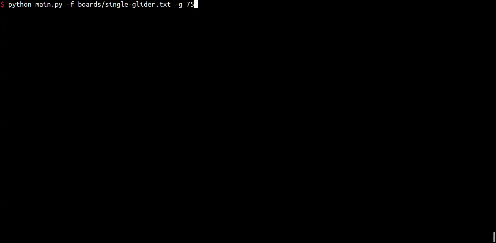
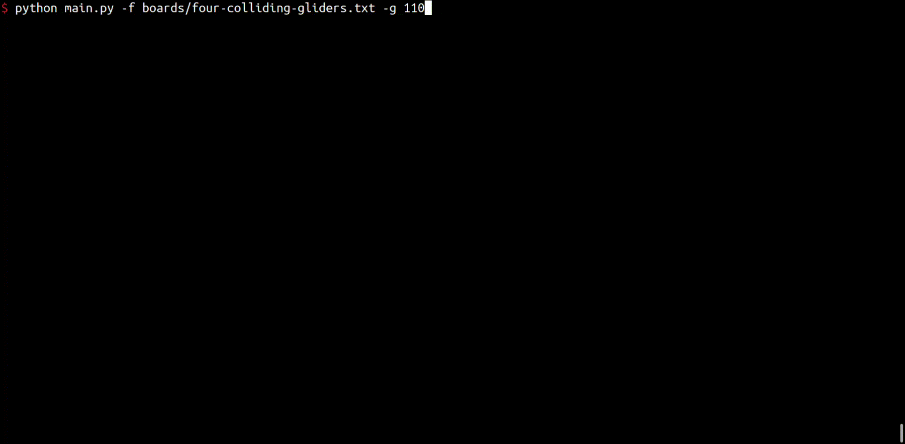

# Conway's Game of Life

Conway's "Game of Life" is a simple "simulation," defined by John Conway. The simulation
defines a group of "cells," which spring to life or die based on their surroundings. You
can read more about it on [Wikipedia](https://en.wikipedia.org/wiki/Conway's_Game_of_Life).

This project will walk you through creating your own, text based version of the simulation.
Note that for the effect to work, you will need a terminal/console that supports readline.
If you are on a Mac of Linux machine, the default system terminal should work. On Windows,
you could use a terminal via
[WSL (Windows subsystem for Linux)](https://learn.microsoft.com/en-us/windows/wsl/install),
install [Git](https://git-scm.com/download/win) and use the terminal that it provides, or
find another terminal that supports readline.

If you would like help working through this project, or learning Python/programming in general:

# Python Concepts

If you are new to Python/programming, it is recommended that you start with the
[lights-out](../lights-out) project. In addition to topics covered in that project (such
as lists, functoins, etc), this will also cover:

* [Commandline Arguments via ArgumentParser](https://docs.python.org/3/library/argparse.html#module-argparse)
and [argv](https://docs.python.org/3/library/argparse.html#module-argparse)
* Reading from files via [with, open, and file.read](https://docs.python.org/3/tutorial/inputoutput.html#reading-and-writing-files).

# Demos

### Single glider

### Four colliding gliders

### Random

# Support Development

If you appreciate this content, and would like to support its development, consider
donating via BuyMeACoffee:

