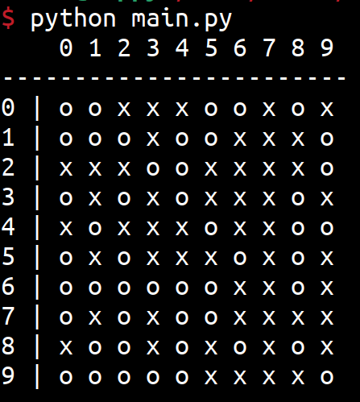
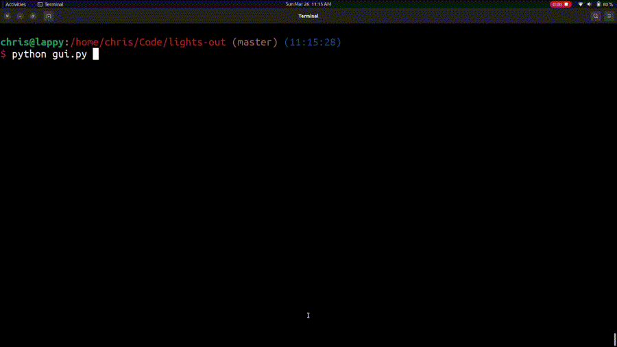

# Lights Out

Lights out is a game in which the player attemtps to turn off all lights in a grid. The challenge is
that when any light is toggled, the lights above, below, and beside the target light are also toggled.
The game ends when all lights in the board are off.

If you would like help working through this project, or learning Python/programming in general:

# Python Concepts

The concepts below are explained in the `main.py` file, so you do not need to
read the information at the following links. They are provided simply for your
reference, in case you would like to read about them in more depth, or view
more examples beyond what is provided here.

* [variables](https://docs.python.org/3/tutorial/introduction.html)
* [classes](https://docs.python.org/3/tutorial/classes.html)
* [if](https://docs.python.org/3/tutorial/controlflow.html#if-statements)
* [while](https://docs.python.org/3/reference/compound_stmts.html#while)
* [functions](https://docs.python.org/3/tutorial/controlflow.html#defining-functions)
* [lists](https://docs.python.org/3/tutorial/introduction.html#lists)

# Demos

### Command line, 3x3 Winner

# Additional Info

Note that you can challenge yourself by increasing the board size:

## GUI

A gui (graphical user interface) is provided for you. If you implement `main.py` correctly, you
should be able to simply run the `gui.py`, and it should work. The gui uses [tkinter](https://docs.python.org/3/library/tk.html),
which should have come by default with your Python install.

If you see errors about not finding the tkinter module,
you may need to search online about how to install it for your specific platform (e.g. Windows 10, Mac OS 10.X.X). If you are
on Ubuntu (or a similar, Debian based Linux distro), try running `sudo apt install python3-tk`, and then running the gui again.

Note that while the gui works, I am not a tkinter expert, and I may be doing stupid things in the code. It isn't
necessarily the best code to reference to make your own gui, and is provided simply to make the game a little more
fun to play (vs playing on the text version).

# Support Development

If you appreciate this content, and would like to support its development, consider
donating via BuyMeACoffee:

